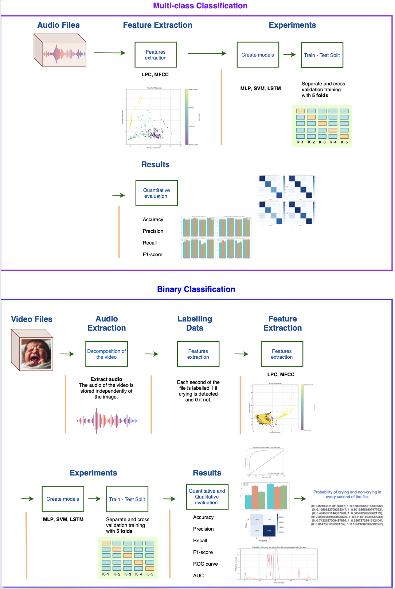
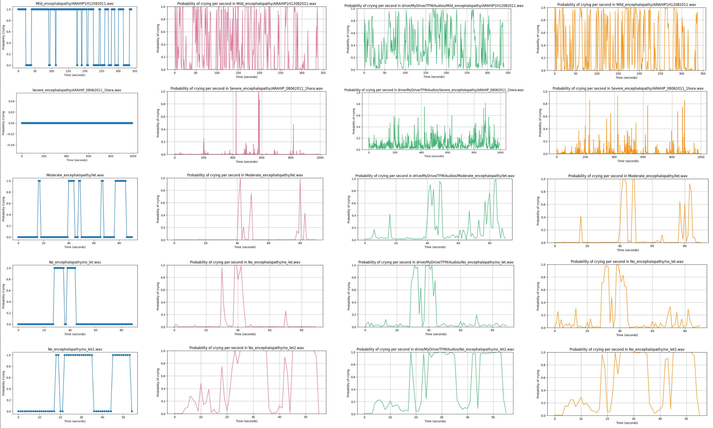
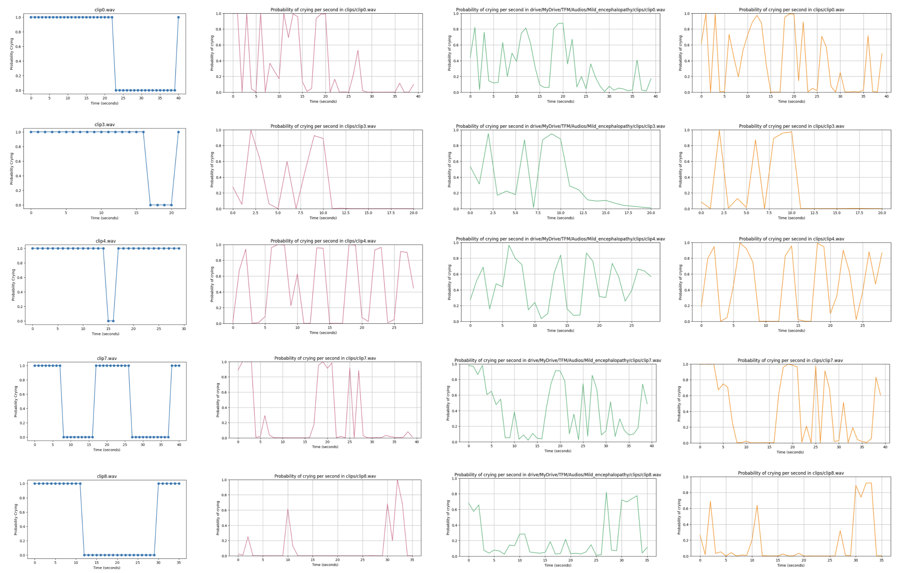

# TFM Newborn Cries Classification

=

***********

**Master's Thesis. Master's in Biomedical Data Science at Universitat Rovira i Virgili.**

#### Author
* **Lucía Núñez Calvo** 

#### Tutors: 
* **Dr. Daniel Urda Muñoz**
* **Dr. Santiago Marco** 

***************
* [Report (81 pages)](http://hdl.handle.net/10609/127059)
* [Notebooks (10 files)]
***************

## General Diagram of the Project

#### Experiments:
* **With Multi-class Classification**:
    * Whithout cross-validation:
        * Extract features with **MFCC**, model **MLP**
        * Extract features with **LPC**, model **MLP**
        * Extract features with **MFCC**, model **SVM** with **One-Vs-Rest**
        * Extract features with **MFCC**, model **SVM** with **One-Vs-One**
        * Extract features with **LPC**, model **SVM** with **One-Vs-Rest**
        * Extract features with **LPC**, model **SVM** with **One-Vs-One**
        * Extract features with **MFCC**, model **LSTM**
        * Extract features with **LPC**, model **LSTM**
    * **Whith cross-validation**:
        * Extract features with **MFCC**, model **MLP**
        * Extract features with **LPC**, model **MLP**
        * Extract features with **MFCC**, model **SVM** with **One-Vs-Rest**
        * Extract features with **MFCC**, model **SVM** with **One-Vs-One**
        * Extract features with **LPC**, model **SVM** with **One-Vs-Rest**
        * Extract features with **LPC**, model **SVM** with **One-Vs-One**
        * Extract features with **MFCC**, model **LSTM**
        * Extract features with **LPC**, model **LSTM**
     
* **With Binary Classification**:
    * Whithout cross-validation:
        * Extract features with **MFCC**, model **MLP**
        * Extract features with **LPC**, model **MLP**
        * Extract features with **MFCC**, model **SVM** 
        * Extract features with **LPC**, model **SVM**
        * Extract features with **MFCC**, model **LSTM**
        * Extract features with **LPC**, model **LSTM**
    * **Whith cross-validation**:
        * Extract features with **MFCC**, model **MLP**
        * Extract features with **LPC**, model **MLP**
        * Extract features with **MFCC**, model **SVM**
        * Extract features with **LPC**, model **SVM**
        * Extract features with **MFCC**, model **LSTM**
        * Extract features with **LPC**, model **LSTM**

| Model | Features | Cross-validation | F1-score (0, 1) | Accuracy | AUC   |
|-------|----------|------------------|-----------------|----------|-------|
| MLP   | MFCC     | No               | 0.69, 0.92      | 0.87     | 0.95  |
| MLP   | LPC      | No               | 0.62, 0.89      | 0.83     | 0.91  |
| MLP   | MFCC     | Yes              | 0.71, 0.93      | 0.89     | 0.95  |
| MLP   | LPC      | Yes              | 0.61, 0.90      | 0.84     | 0.91  |
| SVM   | MFCC     | No               | 0.67, 0.91      | 0.86     | 0.94  |
| SVM   | LPC      | No               | 0.61, 0.90      | 0.84     | 0.89  |
| SVM   | MFCC     | Yes              | 0.70, 0.93      | 0.88     | 0.94  |
| SVM   | LPC      | Yes              | 0.64, 0.92      | 0.87     | 0.90  |
| LSTM  | MFCC     | No               | 0.70, 0.93      | 0.89     | 0.95  |
| LSTM  | LPC      | No               | 0.64, 0.92      | 0.86     | 0.90  |
| LSTM  | MFCC     | Yes              | 0.72, 0.94      | 0.90     | 0.94  |
| LSTM  | LPC      | Yes              | 0.63, 0.92      | 0.86     | 0.90  |

### Quanlitative Results
 
 

