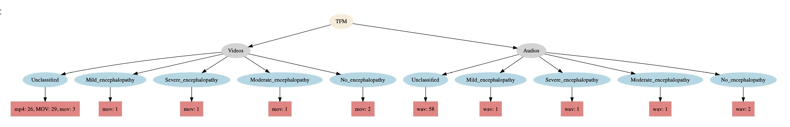

After extracting the audio from the videos, all extracted audio files have the extension **.wav** and the original name of the different files has been preserved. These audio files are organised in the same directory system as the videos and consist of **63 audio files**:
*  Unclassified (58 files)
*  Mild_encephalopathy (1 file)
*  Severe_encephalopathy (1 file)
*  Moderate_encephalopathy (1 file)
*  No_encephalopathy (2 files).

**All videos used in this study were acquired with the written consent of the newborns’ parents, who voluntarily provided their babies’ data, to contribute to the advancement of the study of HIE. However, due to privacy and data protection laws, this project will not include the original videos, audios, or images that would allow identification of the babies, nor will names or any other data that could facilitate identification of the study participants or their family members be released.**

