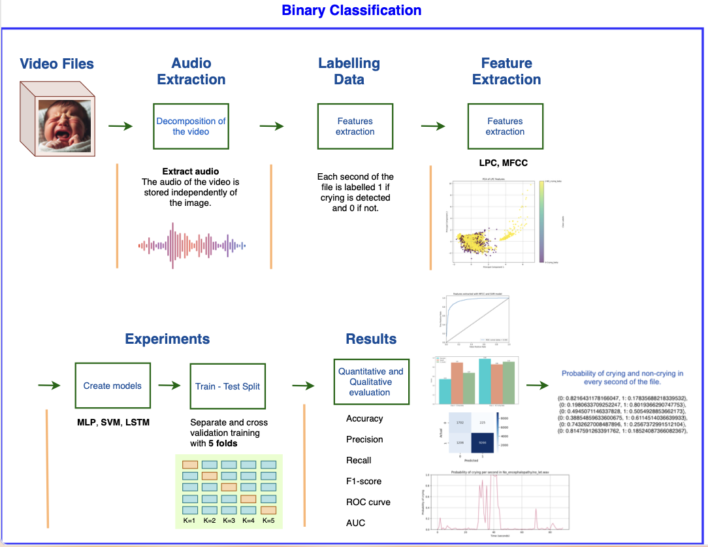

* **7_Notebook-7_Extract_Binary_Features.ipynb**: This notebook is used to extract the characteristics of the binary dataset.
* **8_Notebook-8_MLP_Binary.ipynb**: This notebook shows two implementations of the Multilayer Perceptron (**MLP**) model **with binary classification**.The first implementation tests without cross-validation, while the second implementation tests using cross-validation.
* **9_Notebook-9_SVM_Binary.ipynb**: This notebook shows two implementations of the Support Vector Machine (**SVM**) model **with binary classification**. The first implementation tests without cross-validation, while the second implementation tests using cross-validation.
* **10_Notebook-10_LSTM_Binary.ipynb**: This notebook shows two implementations of the Long Short-Term Memory (**LSTM**) model **with binary classification**. The first implementation tests without cross-validation, while the second implementation tests using cross-validation.

 
